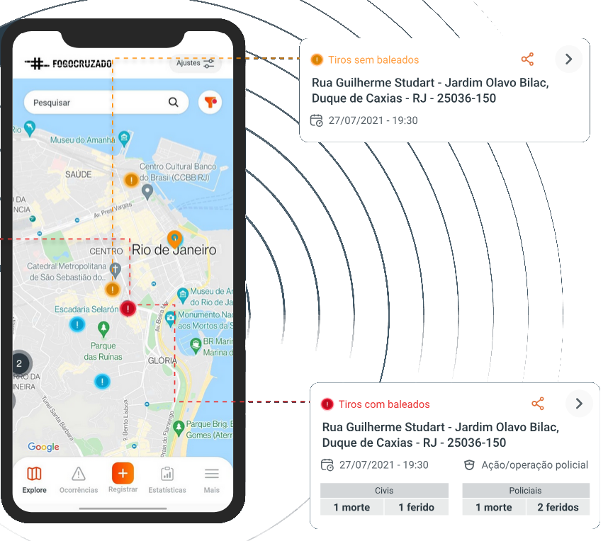
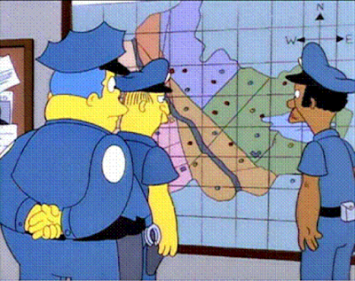
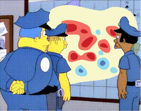
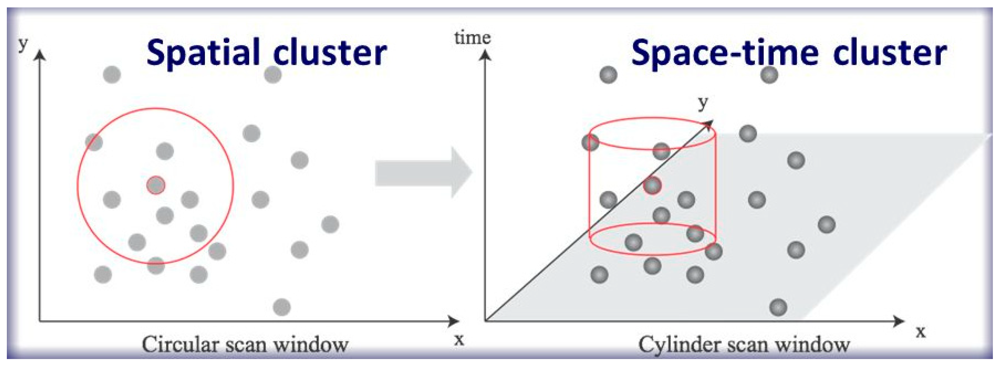
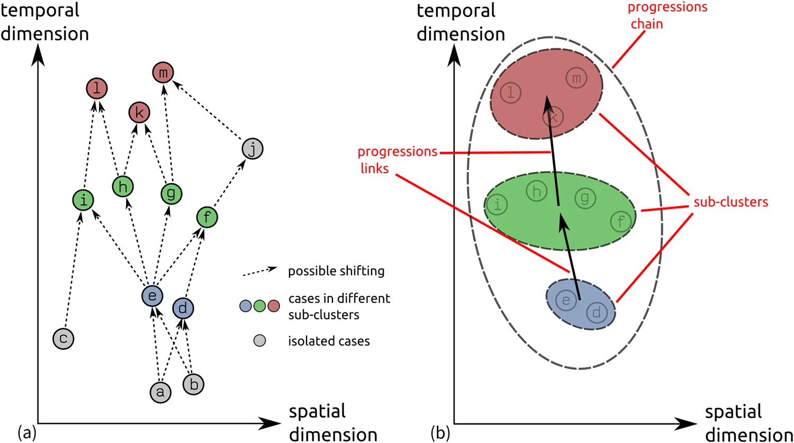

# About me :)

My name is Felipe Sodré Mendes Barros;

I am a geographer, professor at the National University of Argentina and a volunteer at the Fogo Cruzado Institute;


# What is "fogo cruzado"?

## fogo cruzado

> "Fogo Cruzado is a term used in Brazil to describe a conflict involving gunfire. 

## Fogo Cruzado Institute

:::: {.columns}

::: {.column width="60%"}
::: {.nonincremental}

[Fogo Cruzado Institute](fogocruzado.org.br):  

- 1$^{st}$ open database on armed violence in Latin America;  

- It monitor and collects crowd-sourced data from shootings, verified in real time by a specialized local team;  

- Region of interest: Metropolitan regions of Rio de Janeiro, Recife, Salvador, and Belém in Brazil;

:::

:::

::: {.column width="40%"}



:::

::::

# Why data mining on shooting data?

## Why?

::: {.nonincremental}

- Over 60,340 shooting records;

- About 18 new records added daily;

- With spatial coordinates;

- Time stamped;

- With 40 other attribute information about each shooting;

- It is hard to keep up when there is so much going on;

:::

::: footer
Thanks Kenneth Field (cartonerd.blogspot.com/) fot the Simpson's cartoon
:::

# What should we mine?

## What?

- Exploring spatial correlation of the shooting data;

. . .

But:

:::: {.columns}

::: {.column width="60%"}

::: {.nonincremental}

- We would be looking at shootings as if they all happened at the same time;

- It would reinforce segregated and low-security areas that are already stereotyped;

- It would not provide new insights into shooting/crime dynamics.

:::

:::


::: {.column width="40%"}



:::

::::

# So, what about using spatio-temporal correlation?

## The _Knox_ local spatio-temporal

The _Knox_ local spatio-temporal correlation approach is a powerful tool to use because it  considers both spatial ($\tau$) and temporal ($\Delta$) attributes in the analysis.



::: footer
[10.3390/ijgi8030112](https://doi.org/10.3390/ijgi8030112)
:::

# 

And there is more:

::: {.nonincremental}

- This approach not only provides insight into identifying shots that are correlated in space and time;

- It allows us to determine for each observed shooting event whether it is a **lead occurrence** (*spatiotemporally influence other dependent events*), a **lag occurrence** (*those that are spatiotemporally dependent on preceding lead points*), or a **coincident point** (*those that occurs simultaneously with others without a clear lead or lag relationship*);


:::

## In other words

**It also provides new insights by identifying a progression between correlated clustered shots.**



::: footer
[10.1038/s41598-017-12852-z](https://doi.org/10.1038/s41598-017-12852-z)
:::

# Testing this approach for Salvador Metropolitan Region

##

In this analysis we will consider:

::: {.nonincremental}

- shots that occurred between 2022-07-01 and 2024-06-30 for all 13 cities of Salvador's MR;

- 3,473 shots in total;

- $\tau$ we used 5 days as the cut-off time between recordings;

- and 300 metre $\Delta$ limit;

:::

## Results

In Salvador:

```{python}
import folium
import matplotlib
from matplotlib.patches import Rectangle
from matplotlib.lines import Line2D
import matplotlib.pyplot as plt
import pandas as pd
import geopandas as gpd
import pointpats as pp
import contextily as cx

# Reading shooting GeoDataFrame
gdf_shootings = gpd.read_parquet("../data/gdf_shootings.parquet")
# Projecting CRS to UTM 24S
gdf_shootings.to_crs(31984, inplace=True)

# reading cities GeoDataFrame
gdf_rm_salvador = gpd.read_file("../data/dados_BA.gpkg", layer="gdf_rm_salvador")
gdf_rm_salvador.to_crs(31984, inplace=True)

# running global Knox test for each city
results = []
for city in gdf_shootings["city_name"].unique():
    gdf_tiroteios_city = gdf_shootings[gdf_shootings["city_name"] == city].copy()
    min_date = gdf_shootings.date.min()

    # Calculos de dias passados em função do primeiro registro de 2023
    gdf_tiroteios_city["time_in_days"] = gdf_tiroteios_city.date.apply(
        lambda x: x - min_date
    ).dt.days

    tiros_knox = pp.Knox.from_dataframe(
        gdf_tiroteios_city, time_col="time_in_days", delta=300, tau=5
    )

    results.append(
        {
            "city": city,
            "n_tiros": gdf_tiroteios_city.shape[0],
            "p_poisson": tiros_knox.p_poisson,
            "p_sim": tiros_knox.p_sim,
            "mean_tau": gdf_tiroteios_city["time_in_days"].mean(),
        }
    )

results = pd.DataFrame(results)

# filtering cities with p-value lower or equals to 0.05
# Reproduce table 2:
# Cities in the metropolitan region of Salvador with a deviation from the null hypothesis,
# indicating a systematic spatiotemporal correlation in the Knox Global Test.
#results.loc[(results.p_poisson <= 0.05) | (results.p_sim <= 0.05)].reset_index(
#    drop=True
#)[["city", "n_tiros", "p_sim"]]

# Preparing data to test spatio-temporal [local] clustering
# Creating date sequence
min_date = gdf_shootings.date.min()

# Caculating days passed since the first shooting in 2023
gdf_shootings["time_in_days"] = gdf_shootings.date.apply(lambda x: x - min_date).dt.days

# Local Knox Local Spatio-temporal test
tiros_knox_local = pp.KnoxLocal.from_dataframe(
    gdf_shootings,
    time_col="time_in_days",
    delta=300,
    tau=5,
    permutations=99,
    keep=False,
)

tiros_knox_local_ = tiros_knox_local.hotspots()
# joining result with cities GeoDataFrame to identify the city of each shooting
shootings_spatemp_hotspot = tiros_knox_local_.sjoin(gdf_rm_salvador)

# filtering spatio-temporal hotspots with p-value lower or equals to 0.05
shootings_spatemp_hotspot = shootings_spatemp_hotspot.loc[
    shootings_spatemp_hotspot.pvalue <= 0.05
]

# Reproduce table 3:
# Knox local statistics showing the number of lead, lag, and coincident shooting observations for each city.
shootings_spatemp_hotspot.groupby(
    [shootings_spatemp_hotspot.name_muni, shootings_spatemp_hotspot.orientation]
).size().to_frame("value").sort_values(by="value", ascending=False).iloc[:3]

```

## map

```{python}
# Create and save a webmap with Knox Local results

m = tiros_knox_local.explore()
m._location = [-38.49897, -13.00168]
m._zoom_start = 8
m
```

## News


## Link to this presentation


